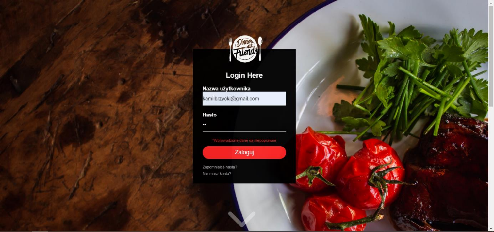
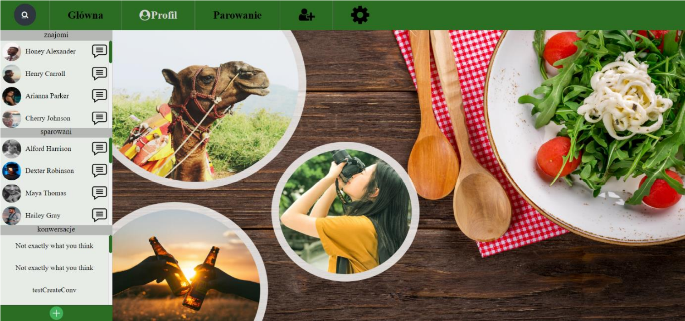
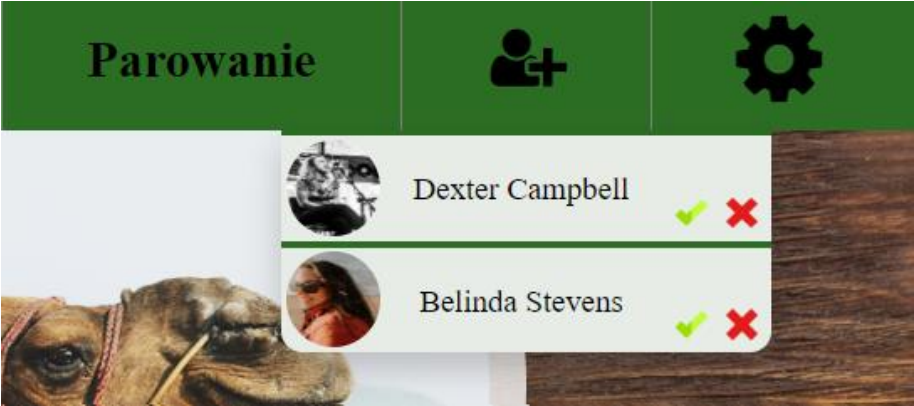
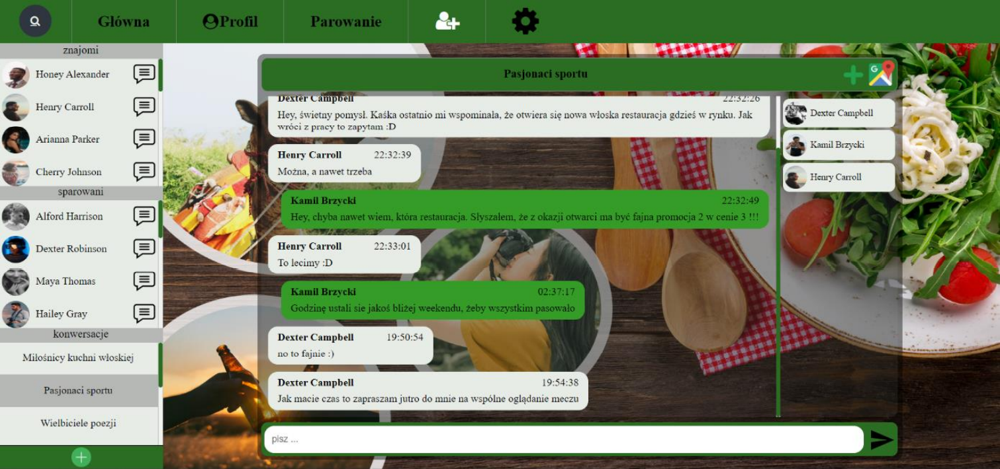
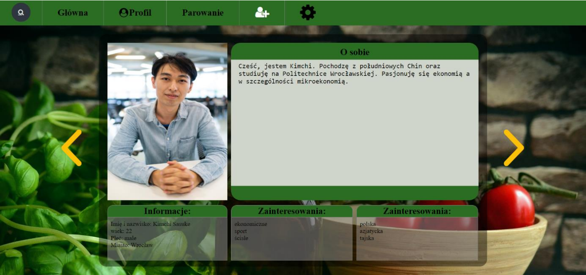
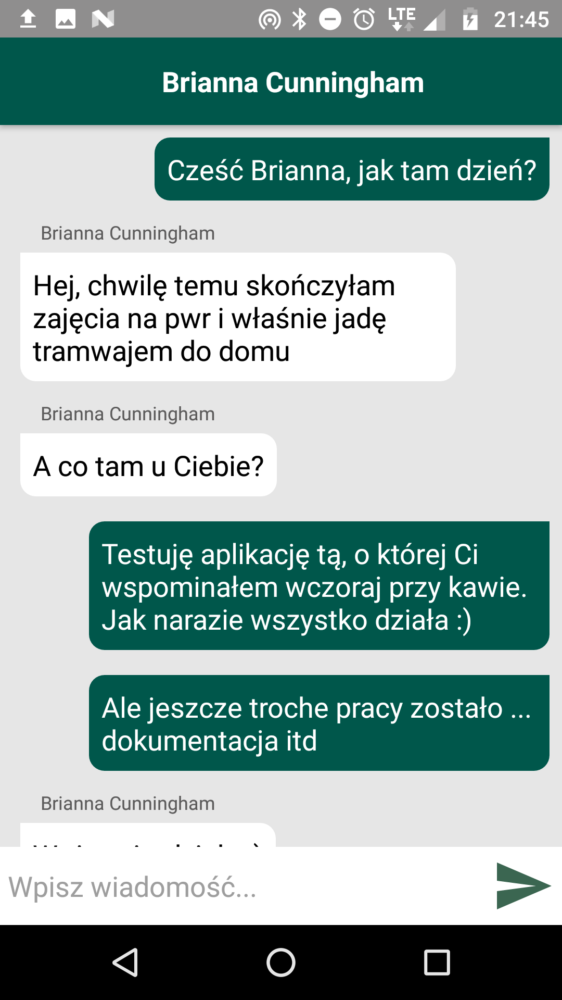

# DinnerWithFriends_Bachelors_Project
Bachelor's project

 

## Table of contents

 

1. [ Features ](#features)
2. [ Technology stack ](#technologies)
3. [ Database schema ](#database)
4. [ Browser application images ](#browser)
5. [ Mobile application images ](#mobile)
6. [ API ](#api)

 

## Features

 

 

## Technology stack

### Server site
* Spring Boot
* Hibernate
* JWT
### Database
* MySQL
### Frontend
* JavaScript
* HTML
* CSS
* Google API (Maps JavaScript API and Places API)
### Mobile Application
* Android

 

# Database schema

 

 

# Browser application

 
 

## Login page 

 

## Registration page 

 

 

## User profile 

 

 

## User profile edit option

 

 

## Main board 

 

 

## Accept friends 

 

 

## Texting interpersonal 

 

 
                                                                    
## Texting within conversation group 

 

 

## Add to conversation group 

 

 

## Find restaurant

 

 

## Find restaurant

 

 

## Matching 

 

 

# Mobile Application

 
 

## Login view 

 

 

## Main view 

 

 

## My profile view

 

 

## Add friends view 

 

 

## Matching view

 

 

## Friends list view 

 

 

## User Profile view 

 

 

## Conversations view 

 

 

## Matched people view 

 

 
 

# API

Exported Postman API is available in Postman_api folder

 
## GET Endpoints

## Static information to show user

**Shows available countries to choose**

#### `/api/countries` 

**Shows available cities to choose**

#### `/api/cities`

**Shows available provinces to choose**

#### `/api/provinces`

**Shows available interestings to choose**

#### `/api/interestings`

**Shows available dietary preferences to choose**

#### `/api/dietarypreferences` 

 

## Profile

**Returns list of friends**
#### `/api/friends/{profileID}`

 
**Delete friend**
#### `/api/friends/delete/{first profileID}/{second profile ID}`

 
**Send friend invitation**
#### `/api/invitations/{sender's profileId}/{receiver's profileID}`

 
**Return list of invitation sent to profile**
#### `/api/invitations/{profileID}`

 
**Accept friend invitation**
#### `/api/invitations/accept/{invitationID}`

 
**Denial friend invitation**
#### `/api/invitations/denial/{invitationID}`

 
**Returns list of matched person**
#### `/api/matcher/matches/{profileID}`

 
**Returns message list for conversation group**
#### `/api/messages/{conversationID}/{profileID}`

 
**Returns myProfile all information**
#### `/api/profiles/myprofile/{profileID}`

 
**Returns (not all) information about profile**
#### `/api/profiles/{profileID}`

` 
**Returns list with id of conversations with unreaded messages**
#### `/api/messages/unread/{profileID}`

 
**Returns boolean value if user have unreaded messages for particular conversation**
#### `/api/messages/unread/{conversationID}/{profileID}`

 
**Return list of conversation group members**
#### `/api/conversations/participants/{profileID}`

 
**Delete particular member from conversation group**
#### `/api/conversations/participants/delete/{conversationID}/{profileID}`

 
**Returns list of sugested (matched by interestings, dietary preferences and localization) people for particular profile**
#### `/api/matcher/candidates/{profileID}`

 
**Update information about user choices at matching screen (used to upload user decision if he want to make an aquaintance with sugested person or not)**
#### `/api/matcher/updateswipe/{ProfileID with higher ID}/{ProfileID with lower ID}/{ProfileID of person who upload info}/{holds "1"- if not interested, "2"- if interested}`

 
**Returns list of conversation groups (made by user)**
#### `/api/conversations/custom/{profileID}`

 
**Returns middle localization cords between conversation group participants and dominating culinary type**
#### `/api/conversations/participants/longlat/{conversationID}`

 

## POST Endpoints

**Login**
#### `/login`
Body example
#### { 
"username":"kamilbrzycki@gmail.com", 
"password":"kamil1997" 
}

**Register**
#### `/register`
Body example
#### { 

"email" : "kamilbrzycki@gmail.com", 
"phone" : "796112221", 
"password" : "kamil1997" 

}

** Send message**
#### `/api/messages`
Body example
#### {  
"profile": { 
            "profileId": 35, 
            "name": "Cherry", 
            "surname": "Johnson" 
        }, 
        "conversationId": 33, 
        "messageInfo": { 
            "messageTxt": "Halko, test powiadomień", 
            "date": "2019-10-15 23:28:29" 
        }
}

**Check if inserted e-mail is available (account with that email do not exist in database)**
#### `/api/emails`
Body example
#### { 
	"email": "grcza@gmail.com" 
}

**Update profile description**
#### `/api/profiles/about`
Body example
#### { 
"profileId" : 32,  
"about" : " testing about note " 
}

**Upload/ update profile image**
#### `/api/images`
Body example
#### { 
	"profileId" : 5, 
	"imageUrl" : "lcxsdasfsddfsfsdfsadfbdfgdsfgdfsgasdfsreagwgsadfsdffsfjfhsdfsadfsdfsfsfsflcxsdasfsddfssdfsadfbdfgdsfgdfsgasdfsreagwgsadfsdffsfjfhsdfsadfsdfsfsfslcxsdasfsddfssdfsadfbdfgdsfgdfsgasdfsreagwgsadfsdffsfjfhsdfsadfsdfsfsfss" 
}

**Create new conversation**
#### `/api/conversations/custom`
Body example
#### { 
"customConversation" : {	 
"name" : "Not exactly what you think", 
"customCreated" : 1 
}, 
"participants" : [ 
	{ 
	"profileId" : 10, 
	"name" : "Tyler", 
	"surname" : "Spencer" 
	}, 
	{ 
	"profileId" : 38, 
	"name" : "Kamil", 
	"surname" :  "Brzycki" 
	}, 
	{ 
	"profileId" : 15, 
	"name" : "Lana", 
	"surname" : "Myers" 
	} 
	
] 
}

 

## PUT Endpoints

**Update profile information**
#### `/api/profiles`
Body example
#### { 
"profileId":31, 
"userId" : 31, 
"firstName" : "Gosia", 
"lastName" : "Bączar", 
"gender" : "female", 
"age" : 22, 

"cityId" : 1, 
"about" : "FFull passion economist, likes football, voleyball, eager to meet other pasionats", 

"dietary" : [1,3,5], 

"interestings" : [1,4,5] 
} 

**Change password**
#### `/api/users/password`
Body example
#### { 
	"userId": 37, 
	"oldPassword": "oldPassword", 
	"newPassword": "newPassword" 
}
