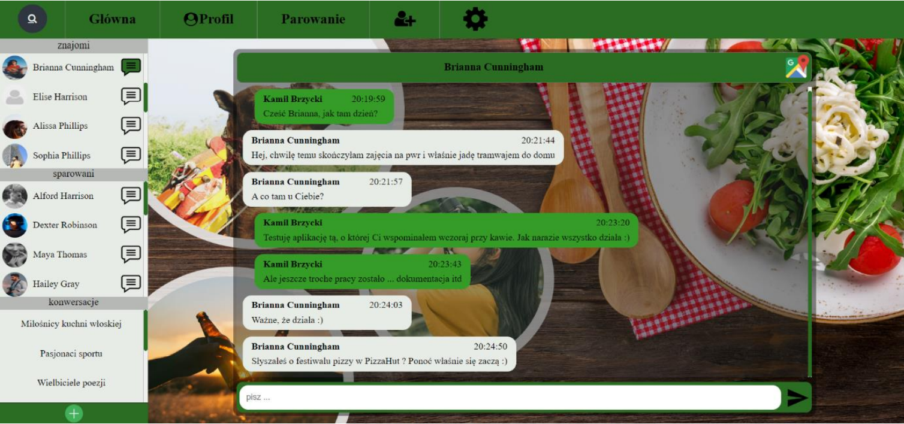
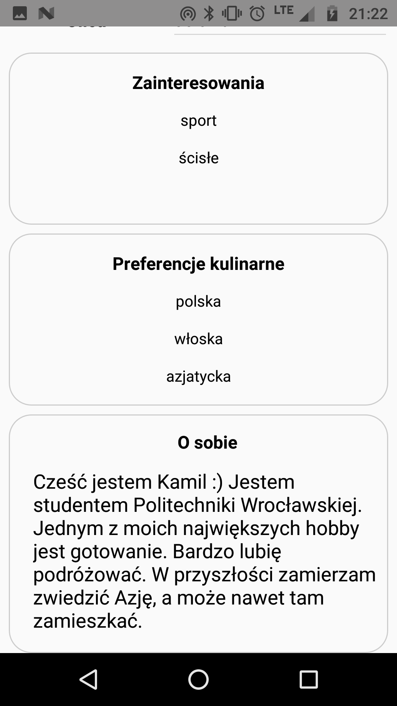
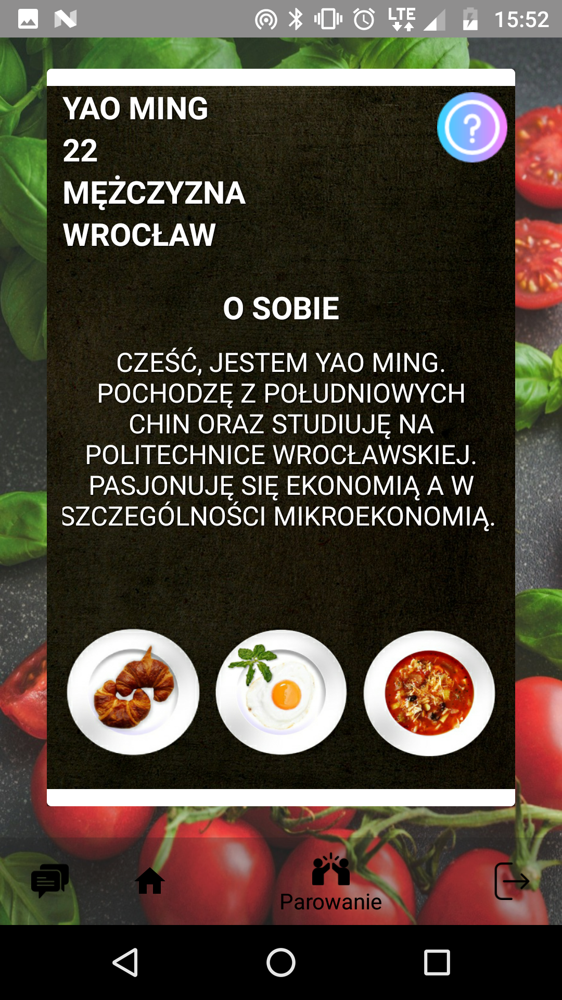
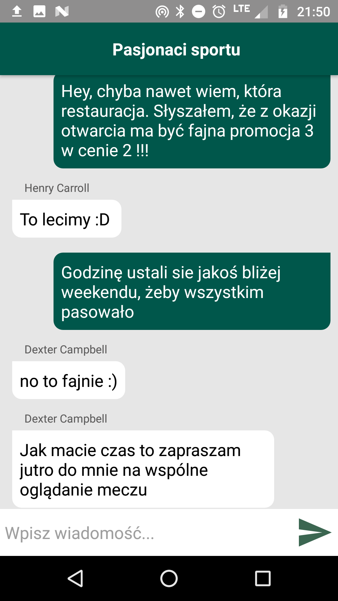
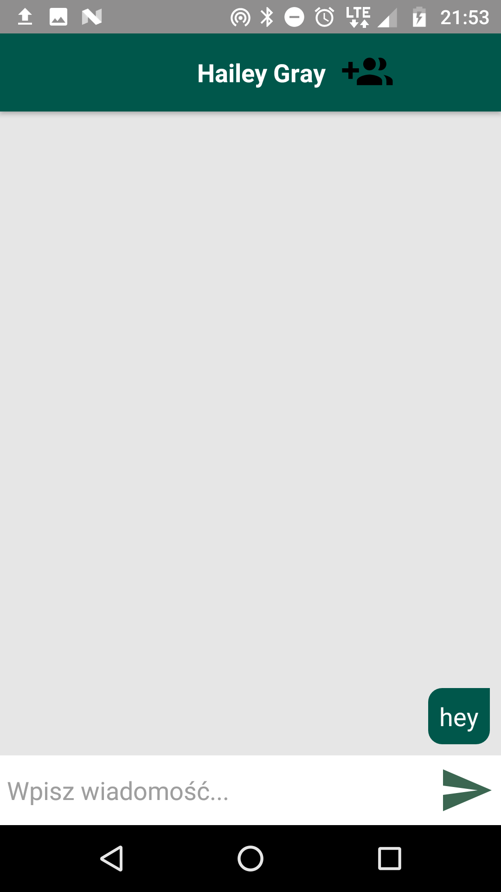
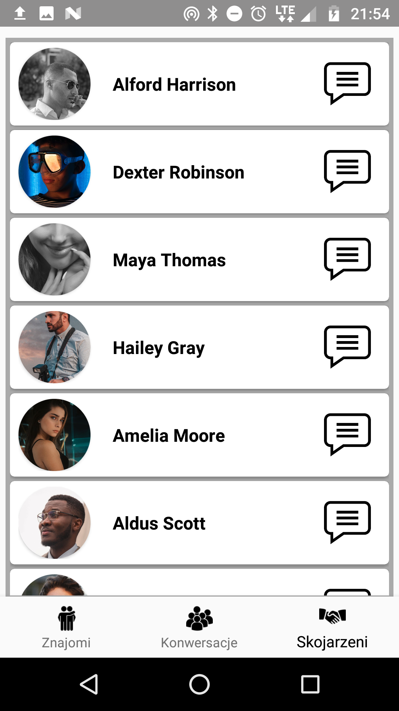

# DinnerWithFriends_Bachelors_Project
Bachelor's project

## Features

## Technology stack

### Server site
* Spring Boot
* Hibernate
* JWT
### Database
* MySQL
### Frontend
* JavaScript
* HTML
* CSS
* Google API (Maps JavaScript API and Places API)
### Mobile Application
* Android

## Database schema

## Browser application

### Login page 

### User profile 

### User profile edit option

### Main board 

### Accept friends 

### Texting interpersonal 

                                                                     
### Texting within conversation group 

### Add to conversation group 

### Find restaurant

### Find restaurant

### Matching 

## Mobile Application

### Login view 

### Main view 

### My profile view

### Add friends view 

### Matching view

### Friends list view 

### User Profile view 

### Conversations view 

### Matched people view 

