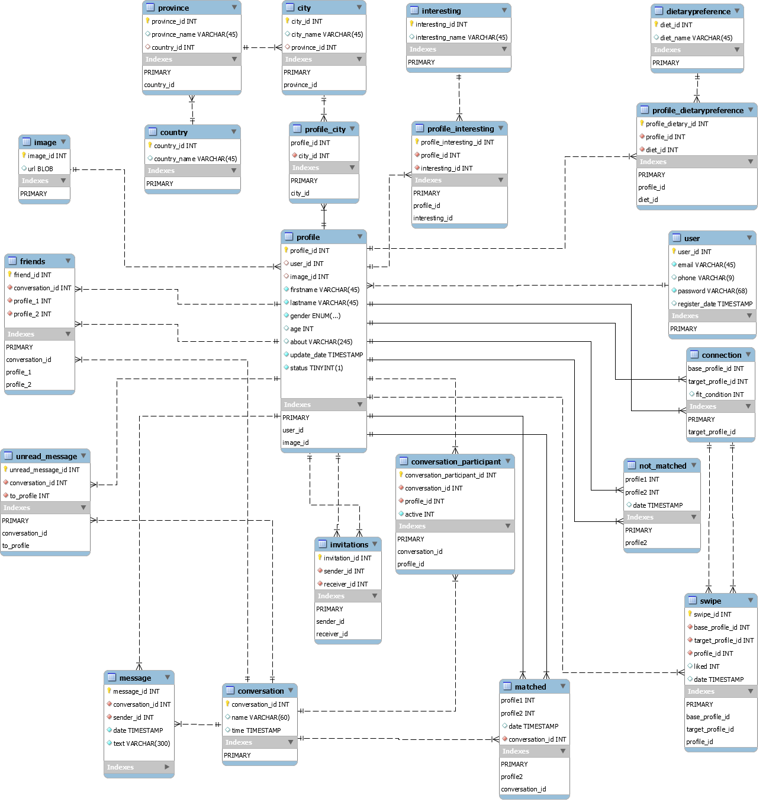
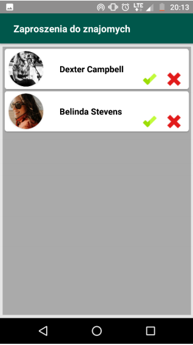
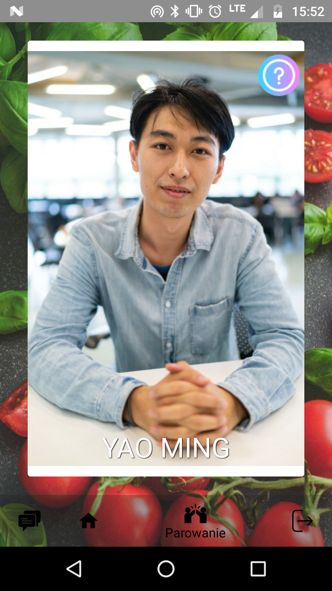

# DinnerWithFriends_Bachelors_Project
Bachelor's project

 

## Table of contents

 

1. [ Features ](#features)
2. [ Technology stack ](#technologies)
3. [ Database schema ](#database)
4. [ Browser application images ](#browser)
5. [ Mobile application images ](#mobile)
6. [ API ](#api)

 

## Features

 

 

## Technology stack

### Server site
* Spring Boot
* Hibernate
* JWT
### Database
* MySQL
### Frontend
* JavaScript
* HTML
* CSS
* Google API (Maps JavaScript API and Places API)
### Mobile Application
* Android

 

# Database schema

 

 

# Browser application

 
 

## Login page 

 

## Registration page 

 

 

## User profile 

 

 

## User profile edit option

 

 

## Main board 

 

 

## Accept friends 

 

 

## Texting interpersonal 

 

 
                                                                    
## Texting within conversation group 

 

 

## Add to conversation group 

 

 

## Find restaurant

 

 

## Find restaurant

 

 

## Matching 

 

 

# Mobile Application

 
 

## Login view 

 

 

## Main view 

 

 

## My profile view

 

 

## Add friends view 

 

 

## Matching view

 

 

## Friends list view 

 

 

## User Profile view 

 

 

## Conversations view 

 

 

## Matched people view 

 

 
 

# API

 
